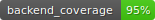

# CodeReviewAi

Test project for code review of a repository.

[](app/coverage.svg)

## Project Setup and Installation
### Environments:

#### Backend

-  **BACKEND_CORS_ORIGINS** - A list with HTTP headers that allow the server to specify any source (domain, schema, or port) other than its own, from which the browser can allow resources to be loaded.

-  **PROJECT_NAME** - Project's name

-  **SECRET_KEY** - This key is used to encrypt all sensitive data and makes your project more secure. Кeep the secret key used in production secret!

-  **GIT_HUB_TOKEN** - Token to GitHub API

-  **OPEN_AI_API_KEY** - Open API key
-  **REDIS_PORT** - REDIS container port

### Installing Poetry

1. **Ensure that Python is installed (version 3.7 and above)**. You can check this by running:
   ```bash
   python --version
    ```
    ```bash
   curl -sSL https://install.python-poetry.org | python3 -
    ```
   ```bash
    pip install poetry
    ```
   
    **run redis container**:
    ```bash
   docker-compose -f docker-compose-redis.yml up -d
    ```
   **run app**
   ```bash
   uvicorn app.main:app --host <your_host> --port <your_port> --log-level info 
   ```
2. **If you don't want to use Poetry yo can start via docker-compose**
    
   **run all containers:**
    ```bash
   docker-compose -f docker-compose.yml up --build
    ```